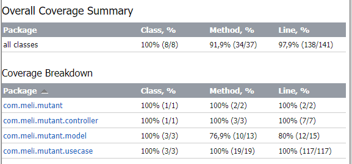

# Examen Mercadolibre

---

## Introducción

El objetivo de este reto es identificar si una secuencia de ADN es mutante o humana, almacenar cada secuencia para poner
a disposición estadísticas de las verificaciones mediante un API REST.

## Tecnologías usadas

* Java 8
* Spring Boot - WebFlux
* PostgreSQL
* AWS - EC2

## Descripción API REST

* URL local: http://localhost:80
* URL hosteada en AWS: http://44.200.108.143:80

### HTTP POST

Permite enviar un JSON con una secuencia de ADN y recibe como respuesta un Status en este caso 200 si es mutante y 403
en caso contrario

Path: URL + /mutant/

Request Body
<pre><code>{
"dna":["ATGCGA","CAGTGC","TTATGT","AGAAGG","CCCCTA","TCACTG"]
}
</code></pre>

Response Status (ADN Mutante):
<pre><code>200 OK</code></pre>

Response Status (ADN Humano):
<pre><code>403 Forbidden</code></pre>

### HTTP GET

Devuelve un JSON con las estadisticas de las veridficaciones de ADN

Path: URL + /stats”

Response:

<pre><code>{
    "count_mutant_dna": 40,
    "count_human_dna": 100,
    "ratio": 0.4
}</code></pre>

## Instalación en local

1. Crear base de datos postgeSQL en local:

<pre><code>Database: mutant
Password: password
</code></pre>

2. Clonar Proyecto desde la rama main:

<pre><code>https://github.com/narengifor/mutant.git</code></pre>

3. En la terminal ejecutar la siguentes lineas de comando:

<pre><code>.\gradlew clean
.\gradles bootjar
cd build\libs
java -jar mutant-0.0.1-SNAPSHOT.JAR
</code></pre>

## Code coverage (>80%)

## Ejemplos (Postman)

* ### ADN Humano

<pre><code>curl --location --request POST 'http://localhost:80/mutant/' \
--header 'Content-Type: application/json' \
--data-raw '{
    "dna": [
        "TTGCGCAGCT",
        "CAGTAAACCT",
        "TTAGAGAGGT",
        "ATTCGGGAAA",
        "CCCAAACTAG",
        "GGGTACTGAA",
        "TTAGAGAGGT",
        "ATTCGGGAAA",
        "TTGCGCAGCT",
        "CAGTAAACCT"
    ]
}'
</code></pre>
* ### ADN Mutante
<pre><code>curl --location --request POST 'http://localhost:80/mutant/' \
--header 'Content-Type: application/json' \
--data-raw '{
    "dna": [
        "ATGCGA", "CAGTGC", "TTATGT", "AGAAGG", "CCCCTA", "TCACTG"
    ]
}'
</code></pre>

* ### Estadísticas
<pre><code>
curl --location --request GET 'http://localhost:80/stats'
</code></pre>

